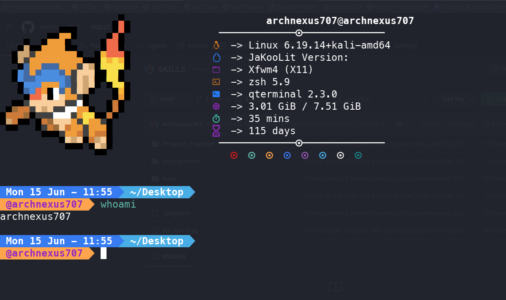

# termcraft

One script to forge a beautiful Debian-Hyprland-style terminal.



## What it does

Transforms a bare Debian/Ubuntu terminal into a fully styled powerhouse:

- **zsh** + **Oh My Zsh** with **agnosterzak** theme
- **JetBrainsMono Nerd Font** for crisp icons and glyphs
- **Tokyo Night** color palette (Catppuccin, Dracula, Gruvbox also available)
- **lsd** — modern `ls` with icons and colors
- **fastfetch + a random Pokémon** side-by-side on shell start (JaKooLit style),
  with a detailed config that surfaces OS, host, kernel, uptime, packages,
  DE/WM, terminal, CPU, GPU, memory, swap, disk, local IP, battery and locale
- **XFCE Terminal** — transparency + font + palette via xfconf or terminalrc

The greeting is exactly what you see in the screenshot above: a Pokémon on the
left, machine info on the right. Turn the Pokémon off with `--no-pokemon`.

## Quick Start

```bash
chmod +x terminal_modifier.sh
./terminal_modifier.sh
```

Open a new terminal window and enjoy your new look.

## Usage

```
./terminal_modifier.sh [OPTIONS]
```

| Flag | Description |
|------|-------------|
| `--scheme tokyonight` | Color scheme (default) — also: catppuccin, dracula, gruvbox, none |
| `--chsh` | Also set zsh as your default shell |
| `--no-pokemon` | Skip the Pokémon greeting (fastfetch only) |
| `--dry-run`, `-n` | Preview every change without touching anything |
| `--yes`, `-y` | Don't ask for confirmation |
| `--list-schemes` | Preview the color schemes (with swatches) and exit |
| `--uninstall` | Undo termcraft: restore `~/.zshrc`, reset xfce4-terminal |
| `--verbose` | Show verbose output (no spinner) |
| `--no-color` | Disable colored output |
| `--no-spinner` | Disable spinner animation |
| `-h`, `--help` | Show help and exit |

Every flag has an environment equivalent (`ARCHNEXUS_CHSH=1`,
`ARCHNEXUS_NO_POKEMON=1`, `ARCHNEXUS_DRY_RUN=1`, `ARCHNEXUS_YES=1`, …).

Before it changes anything the script prints a plan and asks for confirmation
(skip with `--yes`). Your existing `~/.zshrc` is never clobbered — termcraft
manages only a marked block and backs the file up once to
`~/.zshrc.termcraft-backup`.

## Requirements

- Debian / Ubuntu (uses `apt-get`)
- Regular user (not root)

## After Install

- If colors look wrong in xfce4-terminal, log out and back in (xfconf cache).
- If prompt glyphs show as boxes, set terminal font to **JetBrainsMono Nerd Font** explicitly.
- For real transparency: XFCE Settings → Window Manager Tweaks → Compositor.

## Author

**Dickson Massawe** — [@archnexus707](https://github.com/archnexus707)

## Support

If termcraft made your terminal glow, consider buying me a coffee:

[](mailto:archnexus707@gmail.com)

## License

MIT — see [LICENSE](./LICENSE)
